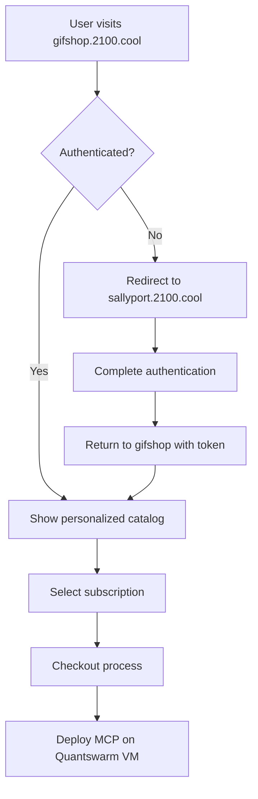

# 🛒 GIFSHOP.2100.COOL - UNIVERSAL E-COMMERCE PLATFORM
## Structured AI Subscription & Gift Experience System

---

## 🎯 EXECUTIVE OVERVIEW

**Mission**: Provide a unified e-commerce platform for all AI subscription types while maintaining clean, structured architecture and preventing code chaos.

**Domains**: 
- Primary: `gifshop.2100.cool`
- Integrated across all customer touchpoints
- Universal subscription management hub

---

# 🏗️ PART I: STRUCTURED ARCHITECTURE

## 1.1 Clean Code Organization

### **Domain-Driven Design Structure**
```
gifshop.2100.cool/
├── 🏠 homepage/                    → Main landing & navigation
├── 🔐 auth/                       → Authentication integration
├── 🛒 subscriptions/              → All subscription types
│   ├── individual/                → Personal AI packages
│   ├── professional/              → Coach/consultant packages
│   ├── academic/                  → Educational packages
│   ├── team-smb/                  → Small business packages
│   ├── enterprise/                → Fortune 500 packages
│   └── custom/                    → Bespoke solutions
├── 🎁 gifts/                      → AI-powered gift experiences
├── 💳 checkout/                   → Payment & billing
├── 📊 dashboard/                  → Account management
├── 🛠️ admin/                     → Platform administration
└── 📚 shared/                     → Common components
    ├── components/                → Reusable UI elements
    ├── services/                  → Business logic
    ├── utils/                     → Helper functions
    └── types/                     → TypeScript definitions
```

## 1.2 Subscription Type Architecture

### **🧑‍💼 Individual Subscriptions**
**Target**: Personal users, hobbyists, individual professionals
```
gifshop.2100.cool/subscriptions/individual/
├── starter/                       → 100 agents, basic features
├── personal-pro/                  → 1,000 agents, advanced features
├── power-user/                    → 10,000 agents, premium features
└── individual-enterprise/         → 50,000 agents, enterprise features
```

**Pricing Structure**:
- **Starter**: $29/month - 100 AI agents
- **Personal Pro**: $99/month - 1,000 AI agents
- **Power User**: $299/month - 10,000 AI agents
- **Individual Enterprise**: $999/month - 50,000 AI agents

### **🎯 Professional Subscriptions**
**Target**: Coaches, consultants, facilitators, solo practitioners
```
gifshop.2100.cool/subscriptions/professional/
├── coach-starter/                 → 1,000 agents, coaching tools
├── consultant-pro/                → 5,000 agents, business tools
├── facilitator-premium/           → 10,000 agents, workshop tools
└── professional-enterprise/       → 25,000 agents, full suite
```

**Pricing Structure**:
- **Coach Starter**: $199/month - 1,000 AI agents + coaching tools
- **Consultant Pro**: $499/month - 5,000 AI agents + business analytics
- **Facilitator Premium**: $799/month - 10,000 AI agents + workshop AI
- **Professional Enterprise**: $1,499/month - 25,000 AI agents + full suite

### **🎓 Academic Subscriptions**
**Target**: Universities, schools, research institutions, students
```
gifshop.2100.cool/subscriptions/academic/
├── student/                       → 500 agents, learning tools
├── faculty/                       → 2,500 agents, teaching tools
├── department/                    → 25,000 agents, research tools
├── institution/                   → 100,000 agents, full platform
└── research-consortium/           → 500,000 agents, collaborative tools
```

**Pricing Structure** (20% Academic Discount):
- **Student**: $19/month - 500 AI agents + learning tools
- **Faculty**: $159/month - 2,500 AI agents + teaching tools
- **Department**: $799/month - 25,000 AI agents + research tools
- **Institution**: $3,199/month - 100,000 AI agents + full platform
- **Research Consortium**: $7,999/month - 500,000 AI agents + collaboration

### **👥 Team/SMB Subscriptions**
**Target**: Small to medium businesses, department teams, startups
```
gifshop.2100.cool/subscriptions/team-smb/
├── startup-team/                  → 2,500 agents, collaboration tools
├── small-business/                → 10,000 agents, business suite
├── department-team/               → 25,000 agents, department tools
└── growing-company/               → 100,000 agents, scaling tools
```

**Pricing Structure**:
- **Startup Team**: $299/month - 2,500 AI agents + collaboration
- **Small Business**: $999/month - 10,000 AI agents + business suite
- **Department Team**: $2,499/month - 25,000 AI agents + department tools
- **Growing Company**: $7,999/month - 100,000 AI agents + scaling tools

### **🏢 Enterprise Subscriptions**
**Target**: Fortune 500-5000, large corporations, global enterprises
```
gifshop.2100.cool/subscriptions/enterprise/
├── enterprise-starter/            → 250,000 agents, basic enterprise
├── enterprise-professional/       → 500,000 agents, full enterprise
├── enterprise-premium/            → 1,000,000 agents, premium features
└── enterprise-unlimited/          → Unlimited agents, custom solutions
```

**Pricing Structure**:
- **Enterprise Starter**: $19,999/month - 250,000 AI agents
- **Enterprise Professional**: $39,999/month - 500,000 AI agents
- **Enterprise Premium**: $79,999/month - 1,000,000 AI agents
- **Enterprise Unlimited**: Custom pricing - Unlimited agents

### **🎁 Gift Experiences**
**Target**: Gift givers, special occasions, corporate gifts
```
gifshop.2100.cool/gifts/
├── personal-ai-assistant/         → 1-month personal AI experience
├── business-boost/                → 3-month business AI package
├── learning-companion/            → 6-month educational AI
├── creative-collaborator/         → AI for artists/creators
└── custom-gift-experiences/       → Bespoke AI gift packages
```

**Gift Pricing**:
- **Personal AI Assistant**: $99 - 1 month, 500 agents
- **Business Boost**: $499 - 3 months, 2,500 agents
- **Learning Companion**: $299 - 6 months, 1,000 agents
- **Creative Collaborator**: $199 - 2 months, 1,500 agents
- **Custom Gift**: $199-$9,999 - Fully customizable

### **🛠️ Custom Solutions**
**Target**: Unique requirements, special projects, enterprise customization
```
gifshop.2100.cool/subscriptions/custom/
├── consultation/                  → Discovery & planning
├── bespoke-development/           → Custom AI solutions
├── integration-services/          → Enterprise integrations
└── managed-services/              → Full-service management
```

**Custom Pricing**:
- **Consultation**: $5,000 - Strategic planning & architecture
- **Bespoke Development**: $25,000+ - Custom AI solutions
- **Integration Services**: $15,000+ - Enterprise system integration
- **Managed Services**: Custom pricing - Full-service management

---

# 🎯 PART II: TECHNICAL IMPLEMENTATION

## 2.1 Clean Architecture Principles

### **Separation of Concerns**
```typescript
// Domain Layer
interface SubscriptionPlan {
  id: string;
  name: string;
  type: SubscriptionType;
  agentCount: number;
  monthlyPrice: number;
  features: Feature[];
}

// Application Layer
class SubscriptionService {
  async createSubscription(planId: string, userId: string): Promise<Subscription>
  async upgradeSubscription(subscriptionId: string, newPlanId: string): Promise<Subscription>
  async cancelSubscription(subscriptionId: string): Promise<void>
}

// Infrastructure Layer
class PaymentGateway {
  async processPayment(amount: number, paymentMethod: PaymentMethod): Promise<PaymentResult>
}
```

### **Shared Components Architecture**
```typescript
// Reusable UI Components
export const PricingCard: React.FC<PricingCardProps>
export const SubscriptionSelector: React.FC<SubscriptionSelectorProps>
export const AgentCountDisplay: React.FC<AgentCountProps>
export const FeatureList: React.FC<FeatureListProps>

// Business Logic Services
export class PricingCalculator
export class SubscriptionValidator
export class AgentAllocationService
export class BillingService
```

## 2.2 Integration Points

### **Authentication Flow**


### **MCP Integration**
```typescript
interface MCPDeploymentService {
  async deployMCP(subscriptionId: string, planType: SubscriptionType): Promise<MCPInstance>
  async allocateAgents(mcpId: string, agentCount: number): Promise<AgentAllocation>
  async configureDashboard(mcpId: string, features: Feature[]): Promise<DashboardConfig>
}
```

## 2.3 Payment & Billing Integration

### **Multi-Tier Payment Processing**
```typescript
class PaymentProcessor {
  // Individual payments
  async processIndividualPayment(amount: number, card: CreditCard): Promise<PaymentResult>
  
  // Professional payments with invoicing
  async processProfessionalPayment(amount: number, invoice: InvoiceDetails): Promise<PaymentResult>
  
  // Academic payments with verification
  async processAcademicPayment(amount: number, academicVerification: AcademicID): Promise<PaymentResult>
  
  // Enterprise payments with purchase orders
  async processEnterprisePayment(amount: number, purchaseOrder: PO): Promise<PaymentResult>
}
```

---

# 🎯 PART III: USER EXPERIENCE FLOWS

## 3.1 Individual Subscription Flow
```
1. Visit gifshop.2100.cool
2. Browse Individual Plans
3. Compare features & agent counts
4. Select plan (Starter → Individual Enterprise)
5. Authenticate via sallyport.2100.cool
6. Complete payment
7. Instant MCP deployment on Quantswarm VM
8. Access personal dashboard
9. Start using AI agents immediately
```

## 3.2 Professional Subscription Flow
```
1. Visit gifshop.2100.cool/subscriptions/professional
2. Professional identity verification
3. Select coaching/consulting specialization
4. Choose plan based on client load
5. Professional authentication & credentials
6. Setup professional billing (invoicing available)
7. Deploy professional MCP with coaching tools
8. Integrate with existing CRM/scheduling systems
9. Onboard first clients to AI-powered services
```

## 3.3 Academic Subscription Flow
```
1. Visit gifshop.2100.cool/subscriptions/academic
2. Academic institution verification
3. Select role (Student/Faculty/Department/Institution)
4. Academic discount application (20% off)
5. Institutional authentication via sallyport
6. Academic billing setup (purchase orders supported)
7. Deploy academic MCP with research tools
8. Integrate with learning management systems
9. Begin AI-powered education/research
```

## 3.4 Gift Experience Flow
```
1. Visit gifshop.2100.cool/gifts
2. Browse gift experiences
3. Customize gift package
4. Add personal message
5. Schedule delivery (immediate or future)
6. Complete gift payment
7. Recipient receives gift notification
8. Recipient creates account & accesses gift
9. Gift activates and MCP deployed
```

---

# 🛡️ PART IV: PREVENTING CODE CHAOS

## 4.1 Architecture Patterns

### **Domain-Driven Design (DDD)**
- Clear domain boundaries for each subscription type
- Shared kernel for common functionality
- Anti-corruption layers for external integrations

### **Clean Architecture**
- Domain logic independent of frameworks
- Dependency inversion for testability
- Clear separation between layers

### **Microservices Architecture**
```
Subscription Service    → Manages subscription lifecycle
Payment Service        → Handles all payment processing
MCP Deployment Service → Manages Quantswarm VM deployment
Notification Service   → Handles email/SMS notifications
Analytics Service      → Tracks usage & metrics
```

## 4.2 Code Organization Standards

### **TypeScript Strictness**
```typescript
// Strict type definitions
interface SubscriptionPlan {
  readonly id: SubscriptionPlanId;
  readonly name: string;
  readonly type: SubscriptionType;
  readonly pricing: PricingTier;
  readonly features: readonly Feature[];
}

// Runtime validation
const subscriptionPlanSchema = z.object({
  id: z.string().uuid(),
  name: z.string().min(1),
  type: z.enum(['individual', 'professional', 'academic', 'team', 'enterprise']),
  // ...
});
```

### **Testing Strategy**
```typescript
// Unit tests for each service
describe('SubscriptionService', () => {
  it('should create individual subscription successfully')
  it('should apply academic discount correctly')
  it('should handle payment failures gracefully')
})

// Integration tests for flows
describe('Subscription Flow Integration', () => {
  it('should complete end-to-end individual signup')
  it('should deploy MCP after successful payment')
})
```

## 4.3 Shared Component Library

### **Reusable UI Components**
```typescript
// Pricing components
export const PricingTable: React.FC<PricingTableProps>
export const PlanComparison: React.FC<PlanComparisonProps>
export const AgentCounter: React.FC<AgentCounterProps>

// Subscription management
export const SubscriptionCard: React.FC<SubscriptionCardProps>
export const UsageMetrics: React.FC<UsageMetricsProps>
export const BillingHistory: React.FC<BillingHistoryProps>

// Gift experience
export const GiftCustomizer: React.FC<GiftCustomizerProps>
export const RecipientSelector: React.FC<RecipientSelectorProps>
```

---

# 🚀 IMPLEMENTATION ROADMAP

## Phase 1: Core E-commerce Platform (Month 1-2)
- ✅ Basic gifshop.2100.cool structure
- ✅ Individual & Professional subscriptions
- ✅ Payment processing integration
- ✅ Basic MCP deployment

## Phase 2: Academic & Team Subscriptions (Month 3)
- 📚 Academic verification system
- 👥 Team collaboration features
- 💳 Institutional billing support
- 🏫 Learning management integration

## Phase 3: Enterprise & Custom Solutions (Month 4)
- 🏢 Enterprise-grade features
- 🛠️ Custom solution consultation
- 📊 Advanced analytics & reporting
- 🔒 Enhanced security & compliance

## Phase 4: Gift Experiences & Mobile (Month 5-6)
- 🎁 Full gift experience platform
- 📱 Mobile app integration
- 🎨 Custom gift creation tools
- 📧 Advanced notification system

---

This structured approach ensures **clean, maintainable code** while providing a comprehensive e-commerce platform for all subscription types. The architecture prevents chaos through clear separation of concerns, shared components, and consistent patterns across all subscription types.

**Ready to build the world's most comprehensive AI subscription platform! 🛒🚀**