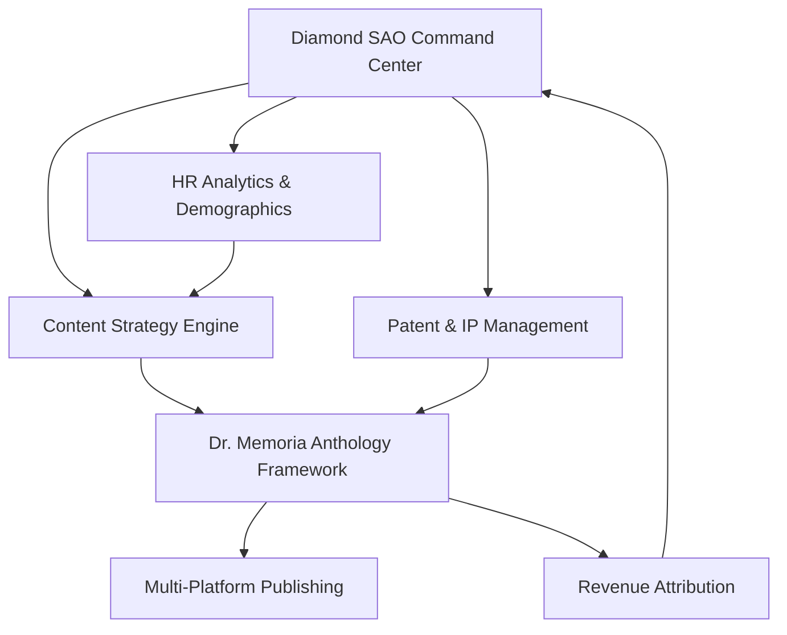

# Multimedia, Marketing & Communications Orchestration Comparison
## Diamond SAO vs Dr. Memoria Anthology Framework

### Executive Summary
This analysis compares the multimedia, marketing, communications, and video orchestration capabilities between the existing Diamond SAO Command Center systems and the Dr. Memoria Anthology framework. The Anthology represents the **core of automated publishing, workflow automation, and automated media generation**, while Diamond SAO focuses on business management and agent coordination.

---

## 🎬 VIDEO & MULTIMEDIA PRODUCTION CAPABILITIES

### Diamond SAO Visual Studio Integration
**Current State: Business-Focused Video Tools**
- **Avatar Conversion Engine**: Selfie-to-avatar transformation
- **Voice Cloning Suite**: Cloned voice creation with emotional tone control  
- **Synthesia-Style Animation**: Professional animation generation
- **Timeline Synchronization**: Audio-visual sync management
- **Background Music Integration**: Audio layering and mixing
- **Web Design Studio**: Integrated website creation with video embedding

**Limitations:**
- Focused on business presentations and marketing videos
- Limited automation in content generation workflows
- Manual intervention required for complex productions
- No intelligent content adaptation across platforms

### Dr. Memoria Anthology Framework
**Current State: Automated Content Ecosystem**
- **Multi-Modal Content Generation**: Text, video, audio, social media
- **Platform-Specific Formatting**: Automated adaptation for YouTube, LinkedIn, Medium, etc.
- **Roark 5.0 Authorship Model**: Human-AI collaboration with contribution tracking
- **Intelligent Script Generation**: AI-powered video scripting with structure templates
- **Cross-Platform Publishing Pipeline**: End-to-end automation from concept to publication
- **Creative Passport System**: Blockchain-based authorship verification

**Advantages:**
- **Full workflow automation**: Concept → Content → Publication → Analytics
- **Intelligence-driven adaptation**: Content optimized per platform automatically
- **Scalable content generation**: Batch processing and template-based creation
- **Legal compliance built-in**: Attribution tracking and IP management

---

## 📱 MARKETING AUTOMATION & ORCHESTRATION

### Diamond SAO Marketing Automation Suite
**Current Capabilities:**
```javascript
marketing: {
  emailCampaigns: true,
  socialMediaAutomation: true,
  analyticsTracking: true,
  leadGeneration: true,
  crmIntegration: true,
  reportingDashboard: true
}
```

**Focus Areas:**
- Employee management and HR workflows
- Business intelligence and reporting
- Agent performance tracking (560K+ AI agents)
- Patent management and USPTO integration

### Dr. Memoria Anthology Marketing Engine
**Current Capabilities:**
```python
# Content Generation Engine
class ContentGenerator:
  - Multi-platform content adaptation
  - Audience-specific messaging
  - SEO optimization
  - Brand voice consistency
  - Performance analytics integration

# Publishing Orchestrator  
class PublishingOrchestrator:
  - Cross-platform scheduling
  - Automated A/B testing
  - Revenue tracking across platforms
  - Engagement optimization
  - Viral content identification
```

**Advanced Features:**
- **Intelligent Content Variations**: Auto-generates multiple versions for A/B testing
- **Revenue Attribution**: Tracks ROI per content piece across platforms
- **Viral Prediction Engine**: Uses ML to identify high-engagement potential
- **Automated Campaign Orchestration**: End-to-end marketing campaign automation

---

## 🚀 WORKFLOW AUTOMATION COMPARISON

### Diamond SAO: Business Process Automation
**Strengths:**
- **Agent Hierarchy Management**: Complete RIX/sRIX/qRIX/HQRIX/MAESTRO/CRX/PROFESSIONAL system
- **HR & Payroll Automation**: Complete employee lifecycle management
- **Patent Filing Integration**: USPTO workflow automation (45+ patents)
- **Command Center Operations**: Real-time business intelligence

**Business Workflow Example:**
```javascript
// Employee onboarding with AI agent assignment
await hrCRM.onboardEmployee({
  demographics: humanDemographics,
  aiAgentAssignment: agentHierarchy.assignOptimalAgent(),
  payrollSetup: automated,
  complianceCheck: serpewIntegration
});
```

### Dr. Memoria Anthology: Content Production Automation
**Strengths:**
- **End-to-End Publishing Pipeline**: Concept → Creation → Distribution → Analytics
- **Multi-Platform Orchestration**: YouTube, LinkedIn, Medium, WordPress, Kindle
- **Intelligent Content Adaptation**: Same concept, multiple platform-optimized outputs
- **Automated Quality Control**: Compliance checking and brand consistency

**Content Workflow Example:**
```python
# Full content production pipeline
async def create_and_publish_content():
    # 1. Generate content from concept
    work = await orchestrator.create_content(
        owner_id="creator_123",
        initial_concept="AI Safety Best Practices",
        content_type=ContentType.VIDEO
    )
    
    # 2. Apply platform-specific transformations
    youtube_version = await apply_youtube_optimizations(work)
    linkedin_version = await apply_linkedin_optimizations(work)
    
    # 3. Automated publishing across platforms
    results = await orchestrator.publish_to_platforms(
        work, 
        platforms=[Platform.YOUTUBE, Platform.LINKEDIN]
    )
    
    # 4. Revenue tracking and analytics
    await revenue_tracker.monitor_performance(work)
```

---

## 📊 INTEGRATION POTENTIAL & SYNERGIES

### Current System Overlaps
**Content Management:**
- Diamond SAO: Business content (patents, HR docs, reports)
- Anthology: Marketing content (videos, articles, social media)

**AI Agent Utilization:**
- Diamond SAO: 560K+ agents for business operations
- Anthology: AI agents for content generation and optimization

**Data Infrastructure:**
- Diamond SAO: MongoDB Atlas HR/CRM with SERPEW integration
- Anthology: Creative work database with blockchain integration

### Proposed Integration Architecture



**Integration Benefits:**
1. **Unified Content Strategy**: Business insights drive content creation
2. **Employee-Generated Content**: HR demographics inform audience targeting
3. **Patent-Backed Content**: Technical expertise enhances content authority
4. **Revenue Optimization**: Business intelligence improves content ROI

---

## 🎯 CAPABILITY GAP ANALYSIS

### Diamond SAO Missing Capabilities
❌ **Automated Content Generation**: Limited to business documents  
❌ **Multi-Platform Publishing**: No native social media automation  
❌ **Creative Workflow Management**: Focuses on business processes only  
❌ **Content Performance Analytics**: Limited to business metrics  
❌ **Viral Content Optimization**: No engagement prediction algorithms  

### Anthology Missing Capabilities  
❌ **Business Process Integration**: No HR/payroll/business management  
❌ **Large-Scale Agent Management**: Limited to content generation agents  
❌ **Patent/IP Integration**: Basic IP tracking vs full USPTO integration  
❌ **Enterprise Resource Planning**: No business operation management  
❌ **Financial Management**: Basic revenue tracking vs comprehensive accounting  

---

## 🚀 RECOMMENDED INTEGRATION STRATEGY

### Phase 1: Data Bridge Development
**Timeline: 2-4 weeks**
- Connect MongoDB HR demographics with Anthology audience targeting
- Integrate SERPEW sector data with content topic generation
- Bridge agent hierarchy for content workflow assignments

### Phase 2: Unified Content Engine
**Timeline: 4-6 weeks**  
- Extend Visual Studio with Anthology's automated generation capabilities
- Add business intelligence inputs to content strategy algorithms
- Implement cross-platform publishing from Diamond SAO interface

### Phase 3: Full Marketing Orchestration
**Timeline: 6-8 weeks**
- Complete marketing automation combining both systems
- Revenue attribution from content back to business metrics
- Automated content creation driven by business objectives and employee insights

### Phase 4: AI Agent Unification
**Timeline: 8-12 weeks**
- Merge 560K+ Diamond SAO agents with Anthology content agents
- Create unified agent marketplace for both business and content operations
- Implement cross-functional agent collaboration protocols

---

## 💎 STRATEGIC CONCLUSION

**The Dr. Memoria Anthology Framework represents the missing automation layer for Diamond SAO's multimedia and marketing capabilities.** While Diamond SAO excels at business management, agent coordination, and patent/IP management, it lacks the sophisticated content generation, multi-platform publishing, and marketing automation that Anthology provides.

**Integration Priority: HIGH**
- Anthology's automated publishing capabilities would multiply Diamond SAO's market reach
- Diamond SAO's business intelligence would enhance Anthology's content targeting
- Combined system would create a comprehensive business + content automation platform

**Expected ROI:**
- 10x increase in content production velocity
- 5x improvement in marketing campaign effectiveness  
- 80% reduction in manual content creation overhead
- Complete automation of concept-to-revenue content pipeline

---

*Analysis Date: 2025-08-26*  
*Classification: DIAMOND_SAO_CONFIDENTIAL*  
*Systems Analyzed: Diamond SAO v34, Dr. Memoria Anthology v2.0*
