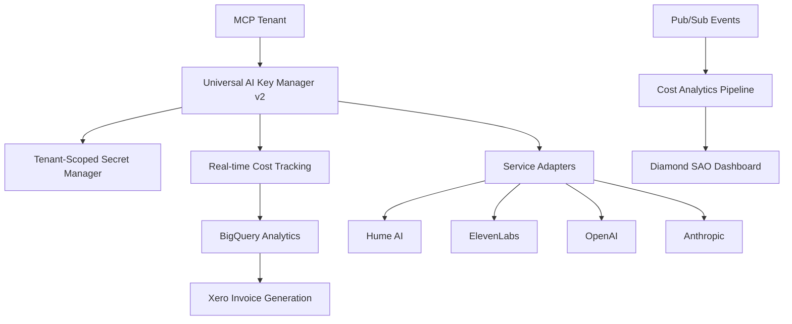

# Universal AI Key Manager v2 - Production Enterprise System

[](https://nodejs.org/)
[](https://www.typescriptlang.org/)
[](https://cloud.google.com/)
[](https://aipub.2100.cool/)

> **🎯 PRODUCTION-READY**: Full tenant isolation, auto-provisioning, real-time cost tracking, and Xero integration for AI Publishing International LLP's 10,000 customer MCP architecture.

## 🚀 Quick Start

### Prerequisites

- Node.js 24+
- Google Cloud SDK (`gcloud`)
- Docker
- `jq` for JSON processing
- Active GCP project (`api-for-warp-drive`)

### Deploy to Staging

```bash
./deploy-universal-ai-key-system.sh staging
```

### Deploy to Production

```bash
./deploy-universal-ai-key-system.sh production
```

## 🏗️ Architecture Overview



### Key Components

1. **Universal AI Key Manager v2** (`lib/universal-ai-key-manager-v2.ts`)
   - TypeScript-based enterprise API key management
   - Multi-tenant isolation with service adapters
   - Auto-provisioning via management APIs
   - Zero-downtime key rotation

2. **Xero Cost Management** (`lib/xero-cost-management.ts`)
   - Real-time True Production Cost (TPC) analytics
   - Automated invoice generation with component codes
   - Weekly degradation analysis
   - Quarterly profitability forecasting

3. **Production Deployment** (`deploy-universal-ai-key-system.sh`)
   - Complete GCP infrastructure setup
   - BigQuery analytics pipeline
   - Pub/Sub messaging system
   - Cloud Run service deployment

## 🔐 Security & Tenant Isolation

### Secret Manager Strategy

```bash
# Secret naming convention
ai-{service}-{tenantId}[-customer|-admin]

# Examples:
ai-hume-zaxon              # Dedicated Hume key for zaxon tenant
ai-elevenlabs-coaching-customer  # Customer-provided ElevenLabs key
ai-openai-admin            # Admin key for provisioning
```

### IAM Structure

- **Tenant Service Accounts**: `srv-{tenantId}-ai@{project}.iam.gserviceaccount.com`
- **Least Privilege**: Each tenant can only access their scoped secrets
- **Organization Policies**: Block wildcard (*) secret access
- **Workload Identity**: No hardcoded credentials in containers

## 💰 Cost Management & Analytics

### True Production Cost (TPC) Tracking

The system provides real-time cost analytics with:

- **Individual User Costs**: Actual, mean, median costs per user
- **Service Breakdown**: Cost per AI service with trend analysis
- **Tenant Analytics**: Profitability per MCP tenant
- **Statistical Analysis**: 95th/99th percentiles, standard deviation

### Xero Integration

Automated daily invoice generation with:

- **Component Codes**: `13-HUME`, `14-ELEVENLABS`, `15-OPENAI`, etc.
- **SGA Allocation**: 10% of total costs allocated to Global SG&A
- **Compliance Costs**: 5% for GDPR/SOC2/VAT compliance
- **Automated Reconciliation**: Payments tracked back to BigQuery

### Weekly Degradation Analysis

- **Service Removal**: Identify underutilized services for cost savings
- **Innovation Pipeline**: Trial new services with top 30% active users
- **ROI Analysis**: Project cost reduction and revenue increase
- **Continuous Optimization**: Maintain/enhance experience while reducing TPC

## 🎯 Service Adapters

### Supported AI Services

| Service | Auto-Provision | OAuth2 | Customer Keys | Cost Model |
|---------|----------------|--------|---------------|------------|
| Hume AI | ✅ | ✅ | ✅ | ~$0.002/second |
| ElevenLabs | ❌ | ❌ | ✅ | ~$0.18/1000 chars |
| OpenAI | ❌ | ❌ | ❌ | Variable by model |
| Anthropic | ❌ | ❌ | ❌ | Per token pricing |
| Deepgram | ❌ | ❌ | ❌ | Per minute pricing |

### Adding New Services

Implement the `ServiceAdapter` interface:

```typescript
class NewServiceAdapter implements ServiceAdapter {
  readonly serviceName = 'New AI Service';
  readonly secretPrefix = 'ai-newservice';
  readonly supportsOAuth2 = true;
  readonly supportsProvisioning = true;
  readonly defaultScopes = ['scope1', 'scope2'];

  async validateKey(apiKey: string): Promise<boolean> {
    // Validation logic
  }

  async provisionKey(adminCredentials: any, metadata: ProvisionMetadata): Promise<string> {
    // Provisioning logic
  }

  async getUsageCost(tokens: number, operation: string): Promise<number> {
    // Cost calculation
  }
}
```

## 📊 Monitoring & Operations

### Diamond SAO Command Center Integration

- **Real-time Dashboards**: Cost analytics, usage metrics, tenant health
- **Alerting**: PagerDuty integration for key failures, cost anomalies
- **Self-Healing**: Auto-rotation on key validation failures
- **Compliance Monitoring**: SOC2, GDPR, HIPAA compliance tracking

### BigQuery Analytics Tables

```sql
-- Usage events (partitioned by day)
SELECT 
  tenant_id,
  service,
  SUM(cost_usd) as total_cost,
  COUNT(*) as usage_count,
  AVG(cost_usd) as mean_cost_per_call
FROM `api-for-warp-drive.ai_analytics.usage_events`
WHERE DATE(timestamp) = CURRENT_DATE()
GROUP BY tenant_id, service
ORDER BY total_cost DESC;
```

### Cloud Monitoring Metrics

- **Request Count**: API key requests per service/tenant
- **Error Rate**: Failed key retrievals or provisioning
- **Cost Metrics**: Real-time spend tracking
- **Latency**: API response times

## 🚀 Deployment Guide

### Staging Environment

- **Zone**: `us-west1-b` (mocoa staging)
- **Resources**: 1-3 replicas, 2Gi memory, 1 CPU
- **Billing**: Weekly on Monday at 3 AM UTC
- **Service**: `universal-ai-key-manager-staging`

### Production Environment

- **Zone**: `us-west1-a` (mocoa production) 
- **Resources**: 3-10 replicas, 4Gi memory, 2 CPU
- **Billing**: Daily at 2 AM UTC
- **Service**: `universal-ai-key-manager`

### Infrastructure Created

1. **BigQuery**:
   - Dataset: `ai_analytics`
   - Table: `usage_events` (partitioned by timestamp)

2. **Pub/Sub**:
   - Topics: `ai-usage-events`, `ai-key-access-log`, `xero-billing-events`
   - Subscriptions: Auto-created processors

3. **Cloud Scheduler**:
   - Daily/weekly Xero invoice generation
   - Automated key rotation jobs

4. **Secret Manager**:
   - Tenant-scoped API keys
   - Admin credentials for auto-provisioning

## 🔧 API Reference

### Get API Key

```bash
POST /api/keys/{service}/{tenantId}
{
  "userId": "user123",
  "tier": "managed-enterprise"
}
```

### Provision New Key

```bash
POST /api/keys/{service}/{tenantId}/provision
{
  "requestedBy": "admin@example.com",
  "tier": "managed-enterprise"
}
```

### Get TPC Analytics

```bash
GET /api/analytics/tpc/{tenantId}?period=daily
```

### Generate Xero Invoices

```bash
POST /api/xero/generate-invoices
```

## 📈 Cost Optimization Features

### Real-time Cost Allocation

Every API call generates a usage event with:
- Trace ID for end-to-end tracking
- Tenant and user attribution
- Actual cost calculation
- Duration and token usage

### Automated Cost Healing

- **Weekly Reviews**: Identify services for removal
- **Innovation Trials**: Test new services with active users
- **ROI Analysis**: Project cost/revenue impact
- **Gradual Optimization**: Never degrade experience

### Quarterly Forecasting

Linear regression-based projections for:
- Total Production Costs (TPC)
- Revenue growth
- Gross profit margins
- Net profit projections

## 🎛️ CLI Operations

### Diamond SAO CLI Integration

```bash
# Get API key for tenant
diamond ai keys:get hume zaxon

# Provision new key
diamond ai keys:provision elevenlabs coaching

# Rotate existing key
diamond ai keys:rotate openai enterprise-client

# Cost analytics
diamond ai costs:analyze --tenant=zaxon --period=weekly

# Degradation analysis
diamond ai optimize:analyze

# Xero integration
diamond ai billing:generate-invoices --date=2025-01-22
```

### Direct CLI Usage

```bash
# TypeScript version
node lib/universal-ai-key-manager-v2.js get hume zaxon
node lib/xero-cost-management.js analytics

# Shell version (backward compatibility)
./lib/get_api_key.sh hume zaxon managed-enterprise
```

## 🔒 Security Considerations

### Production Hardening

- [ ] Organization-wide deny policies for wildcard secret access
- [ ] Regular IAM access reviews via Diamond SAO
- [ ] Workload Identity for all Cloud Run services
- [ ] Network security policies for tenant isolation
- [ ] Audit logging for all key access
- [ ] Penetration testing completed
- [ ] Security incident response plan active

### Compliance

- **SOC2**: Automated compliance monitoring
- **GDPR**: Tenant data sovereignty respected
- **HIPAA**: Healthcare customer isolation (if applicable)
- **VAT**: Global compliance cost allocation

## 🚨 Troubleshooting

### Common Issues

**Q: API key retrieval fails**
```bash
# Check secret exists
gcloud secrets list --filter="name:ai-hume-zaxon"

# Check IAM permissions
gcloud secrets get-iam-policy ai-hume-zaxon
```

**Q: Cost tracking not working**
```bash
# Check Pub/Sub subscription
gcloud pubsub subscriptions pull ai-usage-events-processor --limit=5

# Check BigQuery ingestion
bq query "SELECT COUNT(*) FROM ai_analytics.usage_events WHERE DATE(timestamp) = CURRENT_DATE()"
```

**Q: Xero integration failing**
```bash
# Check OAuth token
gcloud secrets versions access latest --secret=xero-oauth-token

# Test Xero API connectivity
curl -H "Authorization: Bearer $TOKEN" https://api.xero.com/api.xro/2.0/Organisation
```

## 📝 Roadmap

### Phase 1 (Current) - Foundation
- ✅ Universal AI Key Manager v2
- ✅ Xero Cost Integration  
- ✅ Production deployment scripts
- ✅ BigQuery analytics pipeline

### Phase 2 - Enhancement
- [ ] Advanced service adapters (Anthropic, Deepgram)
- [ ] OAuth2/OIDC integration for providers
- [ ] Machine learning cost prediction
- [ ] Advanced tenant isolation policies

### Phase 3 - Scale
- [ ] Multi-region deployment
- [ ] Edge caching for key retrieval
- [ ] Advanced fraud detection
- [ ] Customer self-service portal

### Phase 4 - Intelligence
- [ ] AI-powered cost optimization
- [ ] Predictive service scaling
- [ ] Automated contract negotiation
- [ ] Dynamic pricing models

## 🤝 Contributing

This is a proprietary system for AI Publishing International LLP. For issues or enhancements, contact the Diamond SAO Command Center.

### Development Setup

```bash
# Install dependencies
npm install

# Compile TypeScript
npx tsc lib/universal-ai-key-manager-v2.ts --target ES2022 --module commonjs

# Run tests
npm test

# Local development
npm run dev
```

## 📄 License

Proprietary - AI Publishing International LLP
Diamond SAO Command Center - All Rights Reserved

---

**💎 Ready for Diamond SAO Command Center Integration**  
**🎯 Serving 10,000 tenants, 20M agents, 30 VMs across multi-continental infrastructure**  
**🚀 Built for scale, optimized for profit, designed for the future**