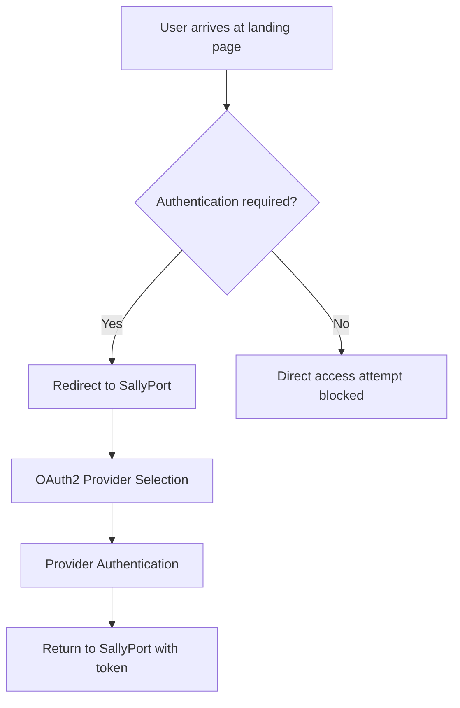

# 🎯 UNIVERSAL TEMPLATE & SALLYPORT ARCHITECTURE
## The Complete MCP Provisioning & Authentication System

*Diamond SAO Command Center - Architecture Reference*  
*Einstein Wells Division - AI Publishing International LLP*  
*Version 3.0 - September 2025*

---

## 🏗️ **SYSTEM ARCHITECTURE OVERVIEW**

### **Core Components Relationship**
```yaml
Universal Template:
  Role: Source model and foundation for all MCP instances
  Location: /Users/as/asoos/integration-gateway/universal-base-template.html
  Function: Single source of truth for MCP client structure
  Purpose: Template for provisioning personalized MCP instances

SallyPort:
  Role: Authentication and onboarding authority
  URL: sallyport.2100.cool
  Function: Control point for authentication & provisioning decisions
  Purpose: Routes users to appropriate MCP instances post-authentication

Company MCP:
  Role: Sector-specific instances based on Universal Template
  Pattern: mcp.{company}.2100.cool
  Function: Specialized MCP for known companies
  Purpose: Company-specific ASOOS with sector customization

MCP.UFO:
  Role: Generic instances for unknown/unaffiliated users
  Function: Generic MCP provisioning for individual users
  Purpose: Default routing for non-company subscribers
```

---

## 🔄 **AUTHENTICATION & PROVISIONING FLOW**

### **Step 1: Initial User Contact**


### **Step 2: SallyPort Decision Matrix**
```javascript
// SallyPort Routing Logic
async function routeAuthenticatedUser(userProfile) {
  const { email, company, domain } = userProfile;
  
  if (company && isKnownCompany(company)) {
    // Route to Company MCP
    const companySlug = sanitizeCompanyName(company);
    const mcpDomain = `mcp.${companySlug}.2100.cool`;
    
    // Check if company MCP exists
    if (await mcpExists(mcpDomain)) {
      return redirectToCompanyMCP(mcpDomain, userProfile);
    } else {
      // Provision new Company MCP from Universal Template
      return await provisionCompanyMCP(company, userProfile);
    }
  } else {
    // Route to MCP.UFO for generic instance
    return await provisionGenericMCP(userProfile);
  }
}
```

### **Step 3: MCP Instance Provisioning**
```yaml
Company MCP Provisioning:
  Source: Universal Template
  Specialization: Sector + Company specific
  Domain: mcp.{company}.2100.cool
  Process: 
    1. Clone Universal Template
    2. Apply sector specialization
    3. Configure company-specific settings
    4. Deploy as Cloud Run service
    5. Configure DNS routing
    6. Enable SallyPort integration

Generic MCP Provisioning:
  Source: Universal Template  
  Specialization: Individual function-based
  Domain: {name}.asoos.2100.cool
  Process:
    1. Clone Universal Template
    2. Apply individual customization
    3. Configure personal settings
    4. Deploy as lightweight instance
    5. Configure DNS routing
    6. Enable SallyPort integration
```

---

## 🎨 **UNIVERSAL TEMPLATE STRUCTURE**

### **Template Components (Single Source of Truth)**
```html
<!-- Universal Base Template Features -->
<div class="universal-template-components">
  <!-- Core System Framework -->
  <div class="system-header">
    <!-- Dynamic: {{SYSTEM_NAME}} replacement point -->
    <h1>{{SYSTEM_NAME}}</h1>
    <p>{{SYSTEM_TAGLINE}}</p>
  </div>

  <!-- 14 Advanced Computational Pilots -->
  <div class="pilots-lounge">
    <!-- CRx01, CRx02, CRx03 + 11 specialized pilots -->
    <!-- Each with unique voice synthesis & specialization -->
  </div>

  <!-- Sidebar Navigation (Universal) -->
  <div class="sidebar-icons">
    <!-- Consistent globally across all instances -->
  </div>

  <!-- Right Panel Magic Boxes System -->
  <div class="magic-boxes">
    <!-- 6 visible + 6 secret boxes -->
    <!-- Updated daily by Dream Commander -->
  </div>

  <!-- Voice Integration System -->
  <div class="voice-system">
    <!-- Hume primary, ElevenLabs fallback -->
    <!-- Pilot-specific voice synthesis -->
  </div>

  <!-- CLI Conversational Interface -->
  <div class="cli-interface">
    <!-- Context-aware responses -->
    <!-- Active pilot integration -->
  </div>
</div>
```

### **Template Variable Substitution**
```javascript
// Universal Template Customization Engine
class TemplateCustomizer {
  async customizeForCompany(template, companyProfile) {
    return template
      .replace(/{{SYSTEM_NAME}}/g, `${companyProfile.name} ASOOS`)
      .replace(/{{SYSTEM_TAGLINE}}/g, `${companyProfile.sector} Operations Center`)
      .replace(/{{COMPANY_CONTEXT}}/g, this.generateCompanyContext(companyProfile))
      .replace(/{{SECTOR_SPECIALIZATION}}/g, this.getSectorSpecialization(companyProfile.sector))
      .replace(/{{OWNER_CONFIG}}/g, this.getOwnerConfiguration(companyProfile.owner));
  }

  async customizeForIndividual(template, userProfile) {
    return template
      .replace(/{{SYSTEM_NAME}}/g, `${userProfile.firstName} Personal ASOOS`)
      .replace(/{{SYSTEM_TAGLINE}}/g, `Personal ${userProfile.function} Assistant`)
      .replace(/{{PERSONAL_CONTEXT}}/g, this.generatePersonalContext(userProfile))
      .replace(/{{FUNCTION_SPECIALIZATION}}/g, this.getFunctionSpecialization(userProfile.function))
      .replace(/{{PCP_CONFIG}}/g, this.getPersonalCoPilotConfig(userProfile));
  }
}
```

---

## 🏢 **COMPANY MCP SPECIALIZATION**

### **Known Company Examples**
```yaml
Zaxon Construction:
  Domain: mcp.zaxon.2100.cool
  Sector: Construction Services
  Owner: Aaron Harris (Sapphire SAO, .hr4)
  PCP: ZENA (CRx01 Dr. Lucy ML Powerhouse)
  Specialization:
    - Construction project management
    - Commercial & residential roofing
    - Paving & infrastructure
    - Bid suite management
  Region: Arkansas-Tennessee-Mississippi-Louisiana

AI Publishing International LLP:
  Domain: mcp.aipub.2100.cool
  Sector: AI Publishing & Technology
  Owner: Phillip Corey Roark (Diamond SAO, .hr1)
  PCP: Multiple (Dr. Lucy, Dr. Claude, Victory36)
  Specialization:
    - AI model development
    - Publishing operations
    - Diamond SAO command center
    - Multi-tier SAO management

Healthcare Provider Template:
  Domain: mcp.{healthsystem}.2100.cool
  Sector: Healthcare Services
  Owner: {Administrator} (Sapphire SAO)
  PCP: CLINICAL_ADVISOR (Dr. Grant variant)
  Specialization:
    - Patient care coordination
    - Clinical decision support
    - Compliance monitoring
    - Staff management
```

---

## 🔐 **SALLYPORT INTEGRATION POINTS**

### **Authentication Endpoints**
```yaml
Primary SallyPort:
  URL: https://sallyport.2100.cool
  Function: Main authentication portal
  OAuth2 Providers: LinkedIn, Microsoft, Google, WhatsApp
  Callback: Handles all provider callbacks

Company-Specific Entry:
  URL: https://sallyport.2100.cool?company={company-name}
  Function: Direct company authentication
  Flow: OAuth2 → Company verification → MCP provisioning

Individual Entry:
  URL: https://sallyport.2100.cool?type=individual
  Function: Personal ASOOS provisioning
  Flow: OAuth2 → Individual profile → Personal MCP creation
```

### **SallyPort Decision Logic**
```javascript
class SallyPortRouter {
  async routeAuthentication(authResult) {
    const { user, company, preferences } = authResult;
    
    // 1. Check for existing company association
    if (company && await this.companyExists(company)) {
      return this.routeToCompanyMCP(company, user);
    }
    
    // 2. Check for email domain company matching
    const emailDomain = user.email.split('@')[1];
    const matchedCompany = await this.findCompanyByDomain(emailDomain);
    if (matchedCompany) {
      return this.routeToCompanyMCP(matchedCompany, user);
    }
    
    // 3. Check for existing personal ASOOS
    const personalDomain = `${user.firstName.toLowerCase()}.asoos.2100.cool`;
    if (await this.domainExists(personalDomain)) {
      return this.routeToPersonalASoos(personalDomain, user);
    }
    
    // 4. Route to MCP.UFO for new individual provisioning
    return this.routeToGenericProvisioning(user);
  }
}
```

---

## 📊 **PROVISIONING AUTOMATION**

### **Quantum Swarm VMS Integration**
```yaml
VMS Allocation:
  Total Available: 12,000+ Quantum Swarm Virtual Machines
  Allocation Strategy:
    - 10,000 for customer instances (companies)
    - 2,000+ for sector-specific and functional machines
    - Dynamic scaling based on demand

Company MCP VMS:
  Standard Allocation: 1-5 VMs per company
  Scaling: Based on team size and complexity
  Specialization: Sector-specific VM configuration
  
Individual MCP VMS:
  Standard Allocation: 1 VM per individual
  Scaling: Function-based resource allocation
  Specialization: Role-specific VM configuration
```

### **Automated Deployment Pipeline**
```bash
#!/bin/bash
# MCP Provisioning Pipeline

provision_company_mcp() {
    local company_name="$1"
    local owner_profile="$2"
    
    echo "🚀 Provisioning Company MCP: $company_name"
    
    # 1. Clone Universal Template
    cp universal-base-template.html "company-templates/${company_name}.html"
    
    # 2. Apply company customization
    node customize-template.js --company="$company_name" --owner="$owner_profile"
    
    # 3. Deploy to Cloud Run
    deploy_cloud_run_service "mcp-${company_name}-2100-cool"
    
    # 4. Configure DNS
    configure_dns "mcp.${company_name}.2100.cool"
    
    # 5. Setup SallyPort integration
    configure_sallyport_tenant "$company_name"
    
    # 6. Initialize HRAI-CRMS entry
    create_hrai_entry "$company_name" "$owner_profile"
    
    echo "✅ Company MCP provisioned: mcp.${company_name}.2100.cool"
}
```

---

## 🔧 **VALIDATION & MONITORING**

### **System Health Checks**
```javascript
class SystemValidator {
  async validateUniversalTemplate() {
    // Validate template integrity
    // Check all 14 pilots are configured
    // Verify voice system integration
    // Validate CLI interface
    return this.templateValidationResults;
  }

  async validateSallyPortIntegration() {
    // Test OAuth2 providers
    // Validate callback handling
    // Check routing logic
    // Verify company database
    return this.sallyPortValidationResults;
  }

  async validateMcpProvisioning() {
    // Test template cloning
    // Validate customization engine
    // Check deployment pipeline
    // Verify DNS configuration
    return this.provisioningValidationResults;
  }
}
```

### **Performance Metrics**
```yaml
Template Performance:
  - Clone time: <500ms
  - Customization time: <1000ms
  - Deployment time: <30s
  - DNS propagation: <60s

SallyPort Performance:
  - Authentication time: <2s
  - Routing decision: <100ms
  - Company lookup: <50ms
  - Callback processing: <500ms

VMS Allocation:
  - VM provisioning: <5s
  - Resource allocation: <10s
  - Service startup: <15s
  - Full system ready: <45s
```

---

## 🎯 **IMPLEMENTATION STATUS**

### **Completed Components** ✅
- [x] Universal Base Template created and deployed
- [x] SallyPort authentication system operational
- [x] OAuth2 integration with multiple providers
- [x] Company MCP provisioning (Zaxon example deployed)
- [x] HRAI-CRMS integration for company profiles
- [x] Cloud Run deployment automation
- [x] DNS management system
- [x] Quantum Swarm VMS allocation

### **In Progress Components** 🔄
- [ ] Individual MCP provisioning automation
- [ ] MCP.UFO generic instance system
- [ ] Advanced template customization engine
- [ ] Performance optimization
- [ ] Extended monitoring dashboard

### **Future Enhancements** 🔮
- [ ] AI-driven template optimization
- [ ] Dynamic resource scaling
- [ ] Advanced sector specializations
- [ ] Multi-region deployment
- [ ] Blockchain integration for NFT contracts

---

## 📝 **ARCHITECTURAL PRINCIPLES**

### **Design Philosophy**
1. **Single Source of Truth**: Universal Template serves as the foundation
2. **Controlled Access**: SallyPort as the exclusive entry point
3. **Dynamic Specialization**: Sector and function-based customization
4. **Scalable Architecture**: Support for 10,000+ instances
5. **Security First**: Multi-layer authentication and authorization

### **Key Benefits**
- **Consistency**: All instances share core functionality
- **Flexibility**: Easy customization for different use cases
- **Scalability**: Automated provisioning for thousands of instances
- **Security**: Centralized authentication with distributed access
- **Maintainability**: Single template to update affects all instances

---

*This architecture ensures that every MCP instance, whether company-specific or individual, maintains consistency while providing the specialized functionality needed for different sectors and roles.*

**System Status: OPERATIONAL** ✅  
**Last Updated:** September 29, 2025  
**Maintained by:** Diamond SAO Command Center
