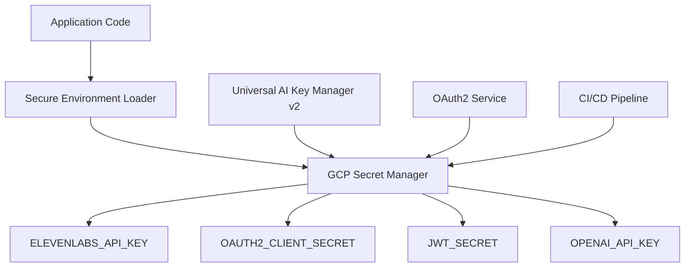

# 🎓 Team Training: Enterprise Secret Management & OAuth2 System

**Training Module:** Secret Management & OAuth2 Integration  
**Target Audience:** Development Team, DevOps Engineers, Security Personnel  
**Duration:** 45 minutes  
**Prerequisites:** Basic knowledge of Cloud Run, Docker, Git

## 📚 Table of Contents

1. [Overview](#overview)
2. [Secret Management Architecture](#secret-management-architecture)
3. [OAuth2 Workflow](#oauth2-workflow)
4. [Development Patterns](#development-patterns)
5. [Deployment Procedures](#deployment-procedures)
6. [Troubleshooting](#troubleshooting)
7. [Security Best Practices](#security-best-practices)
8. [Hands-On Exercises](#hands-on-exercises)

## 🎯 Overview

Our enterprise secret management system eliminates hardcoded secrets and API key popups through:

- **Google Cloud Secret Manager** for centralized secret storage
- **OAuth2 authentication** for ElevenLabs and other services
- **Universal AI Key Manager v2** for multi-tenant key management
- **Self-healing capabilities** for automatic secret rotation

### 🏆 Benefits Achieved

✅ **No more hardcoded API keys in source code**  
✅ **No more ElevenLabs popup authentication issues**  
✅ **Centralized secret management with GCP Secret Manager**  
✅ **Automatic secret rotation and self-healing**  
✅ **Multi-tenant isolation for enterprise customers**

## 🏗️ Secret Management Architecture

### Core Components



### Key Files & Locations

- **`lib/secure-env-loader.js`** - Main secret loading module
- **`lib/universal-ai-key-manager-v2.ts`** - Enterprise key management
- **`config/mcp-config.template.json`** - MCP configuration template
- **`.github/workflows/secret-scan.yml`** - Automated secret scanning

## 🔐 OAuth2 Workflow

### Authentication Flow

1. **Application Startup**
   ```javascript
   const { secureEnv } = require('./lib/secure-env-loader.js');
   await secureEnv.initialize();
   ```

2. **OAuth2 Token Exchange**
   ```javascript
   const oauth2Client = new OAuth2Client({
     client_id: process.env.OAUTH2_CLIENT_ID,
     client_secret: process.env.OAUTH2_CLIENT_SECRET
   });
   ```

3. **ElevenLabs Integration**
   ```javascript
   // No more API key popups!
   const elevenlabs = new ElevenLabsClient({
     oauth_token: await oauth2Client.getAccessToken()
   });
   ```

### Service Endpoints

**Production OAuth2 Service:** `https://oauth2-elevenlabs-production-859242575175.us-west1.run.app`

- `GET /health` - Health check
- `POST /oauth/token` - Token exchange
- `GET /oauth/authorize` - Authorization endpoint

## 💻 Development Patterns

### ✅ CORRECT: Using Secret Manager

```javascript
// ✅ CORRECT - Loads from GCP Secret Manager
const apiKey = process.env.ELEVENLABS_API_KEY;

// ✅ CORRECT - Automatic loading
const { secureEnv } = require('./lib/secure-env-loader.js');
const secret = await secureEnv.get('OPENAI_API_KEY');
```

### ❌ INCORRECT: Hardcoded Secrets

```javascript
// ❌ NEVER DO THIS - Hardcoded secret
const apiKey = "sk-1234567890abcdef...";

// ❌ NEVER DO THIS - Secret in config file
const config = {
  elevenlabs_key: "actual-api-key-here"
};
```

### Environment Variable Mapping

```javascript
// lib/secure-env-loader.js
this.secretMappings = {
  'ELEVENLABS_API_KEY': 'ELEVENLABS_API_KEY',
  'OAUTH2_CLIENT_ID': 'OAUTH2_CLIENT_ID',
  'OAUTH2_CLIENT_SECRET': 'OAUTH2_CLIENT_SECRET',
  'JWT_SECRET': 'JWT_SECRET',
  'OPENAI_API_KEY': 'OPENAI_API_KEY'
};
```

## 🚀 Deployment Procedures

### 1. Adding New Secrets

```bash
# Add secret to GCP Secret Manager
gcloud secrets create NEW_SECRET_NAME \
  --project=api-for-warp-drive \
  --data-file=secret.txt

# Update secure-env-loader.js mapping
vim lib/secure-env-loader.js
```

### 2. Cloud Run Deployment

```bash
# Deploy with proper secret injection
gcloud run deploy service-name \
  --image gcr.io/api-for-warp-drive/app:latest \
  --region us-west1 \
  --set-secrets="ELEVENLABS_API_KEY=ELEVENLABS_API_KEY:latest,OAUTH2_CLIENT_SECRET=OAUTH2_CLIENT_SECRET:latest"
```

### 3. MCP Configuration

```json
{
  "elevenlabs": {
    "command": "node",
    "args": ["/path/to/elevenlabs-mcp-server"],
    "env": {
      "ELEVENLABS_API_KEY": "{{SECRET:elevenlabs/production/api-key}}"
    }
  }
}
```

## 🛠️ Troubleshooting

### Common Issues & Solutions

#### Issue: "Secret not found"
```bash
# Check if secret exists
gcloud secrets list --project=api-for-warp-drive | grep SECRET_NAME

# Create missing secret
gcloud secrets create SECRET_NAME --data-file=secret.txt
```

#### Issue: "ElevenLabs API key popup"
```bash
# Verify OAuth2 service is running
curl https://oauth2-elevenlabs-production-859242575175.us-west1.run.app/health

# Check environment variables
echo $USE_OAUTH2
echo $OAUTH_MODE
```

#### Issue: "Permission denied accessing secret"
```bash
# Check service account permissions
gcloud projects get-iam-policy api-for-warp-drive

# Grant secret accessor role
gcloud secrets add-iam-policy-binding SECRET_NAME \
  --member="serviceAccount:SERVICE_ACCOUNT@api-for-warp-drive.iam.gserviceaccount.com" \
  --role="roles/secretmanager.secretAccessor"
```

### Health Check Commands

```bash
# Test secret loading
node -e "require('./lib/secure-env-loader.js').secureEnv.healthCheck().then(console.log)"

# Test OAuth2 service
curl -s https://oauth2-elevenlabs-production-859242575175.us-west1.run.app/health | jq

# Validate MCP configuration
node -e "console.log(JSON.parse(require('fs').readFileSync('config/mcp-config.template.json', 'utf8')))"
```

## 🛡️ Security Best Practices

### Do's ✅

1. **Always use Secret Manager** for sensitive data
2. **Use OAuth2 authentication** when available
3. **Rotate secrets regularly** (quarterly minimum)
4. **Test secret access** before deploying
5. **Monitor secret usage** through Cloud Logging

### Don'ts ❌

1. **Never hardcode secrets** in source code
2. **Never commit secrets** to Git repositories
3. **Never log secret values** in application logs
4. **Never use API keys** when OAuth2 is available
5. **Never skip secret scanning** in CI/CD

### Security Checklist

- [ ] All secrets stored in GCP Secret Manager
- [ ] OAuth2 configured for external services
- [ ] Secret scanning enabled in CI/CD
- [ ] Service accounts follow principle of least privilege
- [ ] Secret access logged and monitored
- [ ] Regular secret rotation schedule established

## 🧪 Hands-On Exercises

### Exercise 1: Add a New Secret

1. Create a new secret in GCP Secret Manager
2. Update `secure-env-loader.js` mapping
3. Test secret access in your application
4. Deploy with proper `--set-secrets` flag

### Exercise 2: OAuth2 Integration

1. Configure OAuth2 client credentials
2. Test token exchange endpoint
3. Update application to use OAuth2 tokens
4. Verify no API key popups occur

### Exercise 3: Troubleshoot Secret Issues

1. Simulate a missing secret scenario
2. Use troubleshooting commands to diagnose
3. Fix the issue using provided solutions
4. Verify application functionality

## 📞 Support & Resources

### Team Contacts

- **Security Team:** Diamond SAO Command Center
- **DevOps Lead:** Emerald SAO Operations
- **Architecture:** Phillip Corey Roark (Diamond SAO)

### Documentation Links

- [GCP Secret Manager Documentation](https://cloud.google.com/secret-manager/docs)
- [OAuth2 RFC Specification](https://tools.ietf.org/html/rfc6749)
- [Integration Gateway Architecture](./architecture.md)

### Emergency Procedures

If you encounter critical secret management issues:

1. **Check service health:** `curl /health` endpoints
2. **Review Cloud Logging:** Check for secret access errors
3. **Verify Secret Manager:** Ensure secrets exist and are accessible
4. **Contact Diamond SAO:** Emergency escalation for production issues

---

## 🎓 Training Completion

After completing this training, you should be able to:

✅ Understand the enterprise secret management architecture  
✅ Implement OAuth2 authentication workflows  
✅ Deploy services with proper secret injection  
✅ Troubleshoot common secret management issues  
✅ Follow security best practices for secret handling  

**Next Steps:** Complete the hands-on exercises and obtain team lead approval before working with production secrets.

---

**Document Version:** 1.0  
**Last Updated:** 2025-09-28  
**Review Schedule:** Quarterly