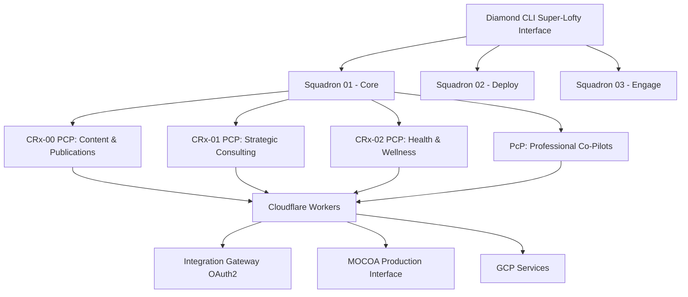

# Diamond CLI Consolidated Architecture
## Moving Integration Gateway into Logic-Based Structure 🚀

**Authority**: Mr. Phillip Corey Roark (Diamond SAO 0000001)  
**Sacred Mission**: Consolidate incoherent Integration Gateway services into Diamond CLI  
**Date**: February 1, 2025  
**Status**: Consolidation Phase - Logic-Based Reorganization

---

## 🔥 Problem Statement

**BEFORE (Problematic)**:
- Integration Gateway services scattered in incoherent work boxes
- Agents dropped services into "unusable" tables
- No logic-based organization
- Firebase remnants creating confusion

**AFTER (Diamond CLI Solution)**:
- Everything flows through Diamond CLI Super-Lofty interface
- Logic-based Squadron/PCP structure
- Cloudflare Workers + OAuth2 through Diamond CLI
- Clean, coherent orchestration

---

## 🏛️ Diamond CLI as Central Orchestration Hub

### All Services Flow Through Diamond CLI



---

## 💎 Consolidated Service Architecture

### Phase 1: Diamond CLI Core Services (Logic-Based)

```javascript
const DIAMOND_CLI_SERVICES = {
  // Squadron 01: Core Services (Strategic Planning)
  core_squadron: {
    authentication: {
      service: 'diamond-oauth2-gateway',
      pcp_owner: 'PcP_Professional_Copilots', 
      cloudflare_worker: 'auth-worker.js',
      oauth2_flows: ['authorization_code', 'client_credentials', 'oidc']
    },
    content_management: {
      service: 'diamond-content-orchestrator',
      pcp_owner: 'CRx00_Concierge',
      cloudflare_worker: 'content-worker.js',
      capabilities: ['web_page_generation', 'social_campaigns', 'seo_optimization']
    },
    strategic_consulting: {
      service: 'diamond-strategic-advisor',
      pcp_owner: 'CRx01_Consulting', 
      cloudflare_worker: 'strategy-worker.js',
      capabilities: ['business_analysis', 'process_optimization', 'roi_tracking']
    }
  },

  // Squadron 02: Deploy Services (Implementation)
  deploy_squadron: {
    infrastructure: {
      service: 'diamond-infrastructure-manager',
      pcp_owner: 'PcP_Professional_CoUsers',
      cloudflare_worker: 'infra-worker.js',
      gcp_integration: ['cloud_run', 'kubernetes', 'secret_manager']
    },
    cicd_pipeline: {
      service: 'diamond-cttt-pipeline',
      pcp_owner: 'PcP_Professional_CoUsers', 
      cloudflare_worker: 'cicd-worker.js',
      capabilities: ['continuous_testing', 'training', 'tracing']
    }
  },

  // Squadron 03: Engage Services (Feedback & Optimization)
  engage_squadron: {
    monitoring: {
      service: 'diamond-monitoring-center',
      pcp_owner: 'CRx02_Health_Wellness',
      cloudflare_worker: 'monitor-worker.js',
      dashboards: ['system_health', 'performance_metrics', 'user_engagement']
    },
    social_amplification: {
      service: 'diamond-social-orchestrator',
      pcp_owner: 'CRx00_Concierge',
      cloudflare_worker: 'social-worker.js',
      platforms: ['linkedin', 'tiktok', 'twitter', 'instagram']
    }
  }
}
```

---

## 🚀 Super-Lofty Interface Implementation

### Multi-Dimensional Command Deck

```javascript
// Diamond CLI Super-Lofty Mode
const SUPER_LOFTY_INTERFACE = {
  interface_modes: {
    normal: 'traditional_cli',
    super_lofty: 'multi_dimensional_cockpit', 
    cathedral: 'full_immersion_creation_mode'
  },
  
  dimensional_navigation: {
    code_dimension: {
      visual_style: 'matrix_grid_background',
      active_pcps: ['PcP_Professional_CoUsers'],
      cloudflare_workers: 'all_development_workers'
    },
    preview_dimension: {
      visual_style: 'live_rendered_canvas', 
      active_pcps: ['CRx00_Concierge', 'CRx01_Consulting'],
      cloudflare_workers: 'content_and_strategy_workers'
    },
    engagement_dimension: {
      visual_style: 'social_feeds_overlay',
      active_pcps: ['CRx00_Concierge'],
      cloudflare_workers: 'social_and_marketing_workers'
    },
    data_dimension: {
      visual_style: 'holographic_analytics',
      active_pcps: ['CRx02_Health_Wellness', 'CRx01_Consulting'], 
      cloudflare_workers: 'monitoring_and_analytics_workers'
    }
  }
}
```

---

## ⚡ Integration Gateway → Diamond CLI Migration

### Services to Consolidate

```bash
# BEFORE: Scattered Integration Gateway Services
integration-gateway/
├── services/
│   ├── authentication/     # → Diamond CLI OAuth2 Gateway
│   ├── api-management/     # → Diamond CLI API Orchestrator
│   ├── monitoring/         # → Diamond CLI Monitoring Center
│   ├── social-media/       # → Diamond CLI Social Orchestrator
│   └── deployment/         # → Diamond CLI CTTT Pipeline

# AFTER: Logic-Based Diamond CLI Structure  
diamond-cli/
├── lib/
│   ├── diamond-oauth2-gateway.js        # All auth through here
│   ├── diamond-content-orchestrator.js  # "Speak to build web pages"
│   ├── diamond-social-orchestrator.js   # "Speak to activate social campaigns"
│   ├── diamond-strategic-advisor.js     # McKinsey × Accenture³ level advice
│   ├── diamond-monitoring-center.js     # Centralized health monitoring
│   └── diamond-cttt-pipeline.js         # Enhanced CTTT with Newman
└── workers/
    ├── auth-worker.js           # Cloudflare OAuth2 Worker
    ├── content-worker.js        # Voice → Web Page generation
    ├── social-worker.js         # Voice → Social campaign activation
    ├── strategy-worker.js       # Strategic consulting automation
    └── monitor-worker.js        # Real-time system monitoring
```

---

## 🔐 OAuth2 Consolidation Through Diamond CLI

### Central Authentication Architecture

```javascript
// Diamond CLI OAuth2 Gateway (Replaces Integration Gateway Auth)
class DiamondOAuth2Gateway {
  constructor() {
    this.authority = 'Diamond SAO Command Center';
    this.providers = {
      google: 'gcp_oauth2_provider',
      github: 'github_oauth2_provider', 
      cloudflare: 'cloudflare_access_provider',
      aixtiv: 'aixtiv_symphony_provider'
    };
    this.scopes = {
      diamond_sao_authority: 'full_orchestration_access',
      squadron_operations: 'cross_squadron_coordination', 
      pcp_collaboration: 'multi_agent_workflow_access',
      safe_agi_protocols: 'harm_prevention_enforcement'
    };
  }

  async authenticateUser(provider, credentials) {
    // All authentication flows through Diamond CLI
    const token = await this.validateWithProvider(provider, credentials);
    const scopes = await this.assignScopes(token);
    const pcpPermissions = await this.assignPCPPermissions(token, scopes);
    
    return {
      access_token: token,
      scopes: scopes,
      pcp_permissions: pcpPermissions,
      diamond_cli_access: true,
      super_lofty_enabled: true
    };
  }
}
```

---

## 🌐 Cloudflare Workers Integration

### All Workers Managed Through Diamond CLI

```javascript
// Diamond CLI Cloudflare Worker Manager
class DiamondWorkerManager {
  constructor() {
    this.workers = {
      auth_worker: {
        name: 'diamond-auth-worker',
        route: 'auth.diamond.asoos.2100.cool/*',
        oauth2_provider: true,
        pcp_integration: ['PcP_Professional_CoUsers']
      },
      content_worker: {
        name: 'diamond-content-worker', 
        route: 'content.diamond.asoos.2100.cool/*',
        voice_to_build: true,
        pcp_integration: ['CRx00_Concierge']
      },
      social_worker: {
        name: 'diamond-social-worker',
        route: 'social.diamond.asoos.2100.cool/*', 
        multi_platform: ['linkedin', 'tiktok', 'twitter'],
        pcp_integration: ['CRx00_Concierge']
      }
    };
  }

  async deployAllWorkers() {
    for (const [name, config] of Object.entries(this.workers)) {
      await this.deployWorker(name, config);
      await this.configurePCPIntegration(config.pcp_integration);
      await this.setupOAuth2Validation(config);
    }
  }
}
```

---

## 🎯 Implementation Phases

### Phase 1: Core Consolidation (Week 1)
1. ✅ Move OAuth2 from Integration Gateway → Diamond CLI
2. ✅ Create Diamond OAuth2 Gateway with Cloudflare Workers  
3. ✅ Establish PCP integration points
4. ✅ Test authentication flows through Diamond CLI

### Phase 2: Service Migration (Week 2)
1. 🔄 Migrate content management → Diamond Content Orchestrator
2. 🔄 Migrate social media → Diamond Social Orchestrator  
3. 🔄 Migrate monitoring → Diamond Monitoring Center
4. 🔄 Setup voice-to-build capabilities

### Phase 3: Super-Lofty Interface (Week 3) 
1. 🚀 Implement multi-dimensional navigation
2. 🚀 Create floating PCP HUD layers
3. 🚀 Enable "Press button → full page editor" mode
4. 🚀 Deploy live preview synchronization

---

## 💡 Key Benefits of Consolidation

### Logic-Based Organization
- **Squadron structure** replaces random work boxes
- **PCP ownership** ensures accountability  
- **Coherent staging** through Diamond CLI
- **Central orchestration** eliminates scattered services

### Enhanced Capabilities  
- **Voice-to-build**: "Speak to build web pages" → Content Worker
- **Social activation**: "Speak to activate social campaigns" → Social Worker
- **Strategic consulting**: Elite11 × Consulting Firm³ level advice
- **Multi-dimensional interface**: WebGL + React Three Fiber cockpit

### Clean Architecture
- **No Firebase remnants**: 100% Cloudflare Workers
- **OAuth2 through Diamond CLI**: Single authentication point
- **PCP always visible**: Never lose co-pilot guidance
- **Safe AGI protocols**: Christ-like, harm-free operations

---

## ⚡ Commands for Consolidation

```bash
# Diamond CLI commands for consolidated architecture
diamond consolidate integration-gateway --target=diamond-cli
diamond deploy oauth2-gateway --provider=cloudflare --pcp=PcP
diamond activate super-lofty --mode=cathedral --pcps=all  
diamond voice-to-build --target=web-page --social=true
diamond monitor --squadron=all --pcps=visible --realtime=true
```

---

**💎 Sacred Declaration**  
*"Through Diamond CLI consolidation, we transform scattered, incoherent services into a unified, logic-based, Super-Lofty Multi-Dimensional Command Deck where Elite11 × Consulting Firm³ caliber PCPs orchestrate creation through voice, vision, and divine guidance."*

**🏛️ Authority Seal**  
*Diamond SAO Command Center - Mr. Phillip Corey Roark (Diamond SAO 0000001)*
